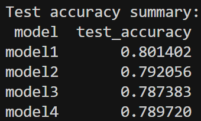

### HTML scraping

Augmented the HTML scraping strategy so that header information is captured in addition to paragraph content. For the binary logistic PCR, performance seemed relatively unchanged (~54.684% vs ~55.925% ) when including headers along with paragraph text. In fact it seems slightly lower. This seems somewhat counterintuitive since you would expect headers to contain key information about the following paragraphs.

### Bigrams

Performed a secondary tokenization of the data to obtain bigrams and fitted binary logistic PCR once more on the bigrams. The way I performed the secondary tokenization was by applying the tokenenser function one more time and obtaining a matrix of two-word frequencies. This matrix was quite spare anse very large, so I further filtered it to only include the more frequent bigrams, to speed up downstream analysis.   Accuracy was slightly better (~58.324%)

### Neural net

For this task, neural networks were developed to evaluate whether the models could outperform logistic PCR. The text was vectorized using a TensorFlow `TextVectorization` layer with tf-idf output. Each model had a different architecture that varied in width, depth, and dropout strength.

- **model1:** shallow network with one 25 unit hidden layer and moderate dropout  
- **model2:** wider single layer network with 64 units and higher dropout  
- **model3:** deeper two layer model with 64 and 32 units and dropout after each layer  
- **model4:** smaller network with 32 units and stronger dropout regularization  

All models used ReLU activation in the hidden layers and a final sigmoid output for binary classification. The optimizer was Adam with binary cross entropy loss, which is one of the options in the TensorFlow docs. Each model was trained for 5 epochs with a 30 percent validation split.

Compared to logistic PCR, which achieved about 56 percent accuracy, the neural networks performed substantially better. Model 1 achieved the highest accuracy at roughly 80 percent. This suggests that a relatively simple architecture is sufficient to capture most of the predictive structure in the tf-idf features, at least with the amount of epochs chosen it was the one that was most quickly became accurate. 